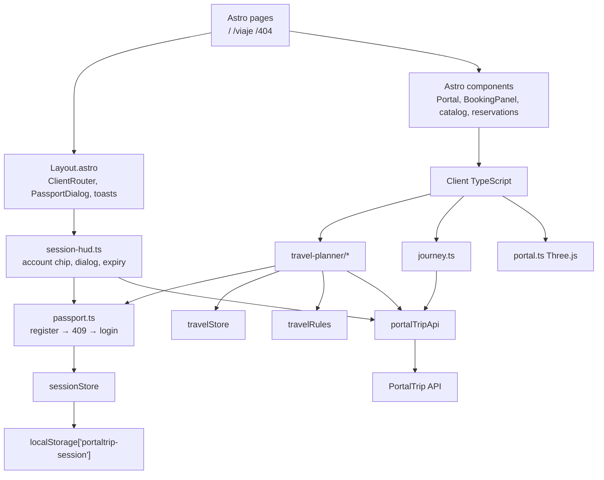

# PortalTrip frontend

Browser app for an interdimensional travel desk. You pick a Rick and Morty location,
choose up to three living companions, get a quote, and buy the trip with the credits
of your PortalTrip passport. Starting a trip opens a journey log built from the same
catalog.

This repository is the UI. The Java API is
[`Prgm-code/portaltrip`](https://github.com/Prgm-code/portaltrip): it serves the
catalog, issues the JWT passport, grants the welcome credits and owns every
reservation. The browser keeps only the session.

## 🔌 Backend de este frontend

**Este frontend trabaja con el backend PortalTrip API.** Repositorio en GitHub:
**https://github.com/Prgm-code/portaltrip**

La UI consume esa API en `http://localhost:8080` sin configurar nada; basta con
tener ambos repositorios descargados y seguir la guía de puesta en marcha de más
abajo. Para otra URL define `PUBLIC_API_URL` (ver `.env.example`).

---

# 🎫 Enterprise Booking System - Full-Stack Integration

> **Desafío Final · Curso Java · Globant Talento Ready · Desafío Latam.**
> PortalTrip es el Proyecto Integrador full-stack del curso: API REST en Java/Spring Boot con PostgreSQL y frontend en TypeScript/Astro, entregados como dos repositorios que se conectan sin configuración adicional en local.

Este repositorio es el **frontend** del Proyecto Integrador PortalTrip. El backend vive en [Prgm-code/portaltrip](https://github.com/Prgm-code/portaltrip).

## 🛠️ Stack Tecnológico

* **Backend:** Java 26, Spring Boot 4.1.1, Spring Data JPA, Hibernate 7.4, Spring Security 7.1 (JWT HS256), OpenAPI/Swagger (springdoc 3.1.0).
* **Frontend:** TypeScript 6 estricto (cero `any`, Biome `noExplicitAny: error`), Astro 7.1 sobre Vite 8, Native ESM, HTML5/CSS3 semántico, Zustand 5, Tailwind CSS 4, Three.js.
* **Infraestructura:** Docker Compose, PostgreSQL 17 Alpine, Dockerfile multi-etapa (Node 24 + nginx).
* **Calidad y Testing:** JUnit 6, Mockito 5, JaCoCo (100% instrucciones y ramas), TDD & Clean Architecture en la API; `astro check` + Biome 2 en la UI.

### Versiones exactas

| Capa | Tecnología | Versión |
| :--- | :--- | :--- |
| Backend | Java (Temurin) | 26 |
| Backend | Spring Boot | 4.1.1 |
| Backend | Spring Security (JWT HS256, OAuth2 Resource Server) | 7.1.1 |
| Backend | Spring Data JPA + Hibernate ORM | 7.4.5 |
| Backend | springdoc-openapi (Swagger UI) | 3.1.0 |
| Backend | Maven Wrapper | 3.9.16 |
| Backend | JUnit Jupiter / Mockito / JaCoCo | 6.0.3 / 5.23.0 / 0.8.15 |
| Base de datos | PostgreSQL (Docker `postgres:17-alpine`) | 17 |
| Frontend | Node.js / pnpm | 24 / 10.34.5 |
| Frontend | Astro (sobre Vite 8.2) | 7.1.6 |
| Frontend | TypeScript (`astro/tsconfigs/strict`, cero `any`) | 6.0.3 |
| Frontend | Tailwind CSS | 4.3.3 |
| Frontend | Zustand | 5.0.14 |
| Frontend | Three.js | 0.185.1 |
| Frontend | Biome (lint + format) | 2.5.7 |
| Infraestructura | Docker Compose (`compose.yml`) + Dockerfiles multi-etapa | Compose v2 |

---

## 🔗 Repositorios de Referencia

* Core de Dominio / Hito 1: https://github.com/sebavidal10/neonpulse-ticketera
* Backend Spring Boot / Hito 4: https://github.com/sebavidal10/neonpulse-api-springboot
* Frontend Vite + TS / Hito 2: https://github.com/sebavidal10/neonpulse-frontend

---

## 🚀 Guía de Puesta en Marcha Local

No hace falta crear ningún `.env`: la UI apunta a `http://localhost:8080` por defecto y la API trae en su perfil `dev` la base de datos, la clave JWT y CORS (`http://localhost:4321`) ya configurados. Requiere Node.js 24, Java 26 y Docker.

### 1. Levantar la Base de Datos Relacional

```bash
cd portaltrip
docker compose up -d postgres
```

PostgreSQL queda activo en `localhost:5432` con el catálogo y el esquema de reservas cargados.

### 2. Ejecutar Pruebas Automatizadas

```bash
./mvnw clean test
```

### 3. Iniciar el Microservicio Backend

```bash
./mvnw spring-boot:run
```

* API REST: http://localhost:8080/api/v1/reservations
* Swagger UI (Perfil Dev): http://localhost:8080/swagger-ui.html

### 4. Iniciar la Interfaz Web Frontend

```bash
cd ../portaltrip-frontend
pnpm install
pnpm dev
```

Requiere Node.js 24 y pnpm 10 (`npm install -g pnpm`). Si prefieres npm, `npm install` y `npm run dev` también funcionan.

* App Web: http://localhost:4321

Con los dos repositorios descargados uno junto al otro no hay que crear ningún
`.env` ni tocar configuración: la UI apunta a `http://localhost:8080` y la API
acepta el origen `http://localhost:4321` por defecto.

Ciclo completo: crea tu pasaporte desde el botón de la cabecera (registro con email y contraseña), elige un destino, pide la cotización y confirma la reserva. La API la guarda en PostgreSQL y la lista de reservas se refresca en la UI sin recargar la página. `pnpm build` ejecuta `astro check`, Biome y la compilación sin errores.

---

## ☁️ Despliegue en Coolify (o cualquier host Docker)

El repositorio incluye un `Dockerfile` multi-etapa (build con Node 24 y pnpm,
servido por nginx en el puerto 80) y `nginx.conf`.

1. En Coolify crea una aplicación desde este repositorio con **Build Pack: Dockerfile**.
2. Añade la variable `PUBLIC_API_URL=https://<dominio-de-tu-api>` y márcala como
   **Build Variable**: Astro incrusta la URL en el bundle durante `pnpm build`.
3. Puerto expuesto: `80`. Asigna el dominio del frontend.
4. En la API añade ese dominio a `APP_CORS_ALLOWED_ORIGINS` (ver README del backend).

Prueba local de la imagen:

```bash
docker build --build-arg PUBLIC_API_URL=http://localhost:8080 -t portaltrip-frontend .
docker run --rm -p 4321:80 portaltrip-frontend
```

---

## Architecture

Astro prints the first HTML. After that, the session is vanilla TypeScript: DOM
events, `fetch`, and two Zustand stores. There is no React tree and no form library.
Vite is the bundler Astro already ships.

```text
Browser
├── Astro pages          file routes, first paint
├── Astro components     static markup, passport dialog, slots
├── Client scripts       events, rendering, session HUD, WebGL
├── Domain models        enums, labels and API shapes
├── Travel rules         instant quote + local validation
├── Zustand stores       travelStore (catalog, draft, view) · sessionStore (JWT, balance)
└── API client           fetch + timeout + envelope + bearer + typed errors
        └── PortalTrip API (/api/v1)
```



### Rendering split

| Layer | Lives in | Job |
| :--- | :--- | :--- |
| Routes | `src/pages/` | `/` planner, `/viaje` journey log, `/404` |
| Shell | `src/layouts/Layout.astro` | document, View Transitions `ClientRouter`, starfield, CRT overlay, jump flash, passport dialog, toast region |
| Markup | `src/components/` | header with account chip, booking form with passport step, catalog, reservations, portal canvas host |
| Client boot | `src/scripts/app.ts`, `src/scripts/journey.ts`, `src/scripts/session-hud.ts` | start the planner or the log after each `astro:page-load`; the HUD runs on every page |
| Passport | `src/scripts/passport.ts` | register with fallback to login, passport mode switching, field reading |
| Planner | `src/scripts/travel-planner/` | form, local catalog search and paging, instant quotes, purchase with idempotency, reservation actions |
| Scene | `src/scripts/portal.ts`, `src/scripts/starfield.ts` | slime portal (Three.js + custom shaders) and warp field (2D canvas) |
| Transitions | `src/scripts/portal-jump.ts`, `src/styles/transitions.css` | origin of the jump, shared `journey-stage` name, CRT persist |
| DOM factories | `src/ui/` | catalog cards, errors, journey view. Untrusted text goes through `textContent` |
| Domain | `src/models/` | `TripType`, `RiskLevel`, `ReservationStatus` (API codes plus Spanish labels), `Reservation`, catalog types, auth types |
| Rules | `src/utils/travelRules.ts` | instant quote breakdown, booking and passport checks, credit formatting |
| State | `src/stores/travelStore.ts`, `src/stores/sessionStore.ts` | catalog, draft and view in memory; JWT session and balance persisted |
| Network | `src/services/portalTripApi.ts` | `fetch`, 8s timeout, `AbortController`, envelope unwrapping, bearer header, `Idempotency-Key`, `?apiError=` preview |

Internal imports use path aliases from `tsconfig.json` (`models/*`, `services/*`,
`stores/*`, and the rest). Relative `../../` climbs are not the convention here.

### Data flow

1. `Layout.astro` mounts the shell. `ClientRouter` keeps the CRT overlay and jump
   flash across navigations (`transition:persist`). `session-hud.ts` hydrates the
   session, paints the account chip and refreshes the balance with `GET /users/me`.
2. On `/`, `scripts/app.ts` waits for `#booking-form`, then `initializeApp()`.
   Listeners bind once. `GET /locations` and `GET /characters` load in parallel and
   stay cached for the session; search and paging run in the browser. The page reads
   like an airline desk: hero with the welcome-credit invite, a search deck (origin,
   destination, date, passengers), featured routes with starting fares, then the
   results column next to the checkout console.
3. The form is the source of the draft. `readDraft()` uses `FormData`.
   `validateReservation()` runs before anything reaches the network. The quote shown
   while typing is computed locally with the same rules as the API.
4. Without a session the form shows the passport step. Submitting calls
   `POST /auth/register`; a `409` flips the step to login and calls
   `POST /auth/login`. The response carries the JWT and the welcome credits.
5. `POST /reservations` is sent with an `Idempotency-Key` bound to the exact request
   body. Retries reuse the key, so the balance is never charged twice. The response
   returns the reservation and `remainingBalance`.
6. Only the session persists. `localStorage["portaltrip-session"]` stores the token,
   its expiry and the profile. A `401` clears it and reopens the passport dialog.
7. `startReservation()` navigates to `/viaje`. `portal-jump.ts` records the click
   origin, adds `html.jumping` so cards and panels vanish toward the portal while the
   starfield warps (the canvas has its own `view-transition-name`, so it stays live
   behind both snapshots), delays the loader until the exit finishes, flashes the
   viewport, and names the reservation card `journey-stage` so View Transitions can
   morph it into the log.
8. `/viaje` reads the reservation from `GET /reservations/{id}`, moves it to
   `IN_PROGRESS` with `PATCH .../start`, and builds the log from the cached catalog
   plus `GET /episodes`. Completing the trip calls `PATCH .../complete`.

Reservation states match the API:

```text
CONFIRMED → IN_PROGRESS → COMPLETED
    │
    └──→ CANCELLED (refunds the total)
```

`COMPLETED` and `CANCELLED` are terminal. The API rejects illegal transitions with
`409`; cancelling is only offered for confirmed reservations.

### Why this shape

The API is the system of record for money and reservations, so the browser never
invents a booking. Keeping `fetch` in `services/` and the session in `sessionStore`
means the planner can recover from an expired token without losing the draft. Astro
is here for pages, View Transitions, and the first HTML. The planner is still a DOM
app on purpose: typed events, no virtual DOM, no extra runtime.

Quote math (base 1200, trip multipliers, station surcharge, insurance 190 per
passenger, risk from resident count) lives in `travelRules.ts` so the price updates
on every keystroke. It mirrors `QuoteCalculator` in
[`portaltrip`](https://github.com/Prgm-code/portaltrip); the total actually charged
is the one returned by the API.

The passport asks for a password because the API requires one (8 to 64 characters).
It is a single field with a show/hide toggle, asked once, in the same card as the
trip. Reservations saved by the previous local-only version under
`localStorage["reservas"]` cannot be imported (the API would charge them), so the
reservations panel shows them once as a local archive that can be discarded.

## Stack

- Astro 7 and Vite
- TypeScript, `astro/tsconfigs/strict`
- Zustand 5 (vanilla + persist)
- Tailwind CSS 4
- Three.js for the portal disc
- Biome for format and lint
- [PortalTrip API](https://github.com/Prgm-code/portaltrip) for catalog, passport, credits and reservations

## Getting started

Requires Node.js 24, pnpm 10 and a running PortalTrip API.

```bash
# API (from the portaltrip repository). Its dev profile already ships the
# database, JWT and CORS defaults for http://localhost:4321.
docker compose up -d --build

# UI (.env is optional; PUBLIC_API_URL defaults to http://localhost:8080)
cp .env.example .env
pnpm install
pnpm dev
```

Open `http://localhost:4321`. npm scripts (`npm install`, `npm run dev`) work if
you do not use pnpm. The header pill pings `GET /health`, so a red uplink means the
API is not reachable from the browser.

```bash
pnpm check      # astro check && biome check
pnpm build      # check, then astro build
pnpm preview    # serve dist/
pnpm format     # biome format --write .
```

Force catalog error UI without editing code:

```text
http://localhost:4321/?apiError=404
http://localhost:4321/?apiError=429
http://localhost:4321/?apiError=500
```

## Open source policy

PortalTrip frontend is open source under the [MIT License](LICENSE).

You may use, copy, modify, merge, publish, distribute, sublicense, and sell the
software, provided the copyright notice and license text stay with the source.
Contributions sent through pull requests are accepted under the same license.
There is no CLA.

What we will merge:

- Bug fixes, tests, and accessibility patches
- Documentation that matches the code
- Features discussed in an issue when they keep the Astro + vanilla TypeScript split

What we will not merge:

- A second UI runtime (React, Vue, Svelte) for the planner
- Persistence format changes without a migration plan for `localStorage["portaltrip-session"]`
- Secrets, personal catalog dumps, or generated `dist/` / `node_modules/`

Rick and Morty names, characters, and imagery belong to their owners. This project
is a fan-made client; the catalog is a copy of the unofficial
[Rick and Morty API](https://rickandmortyapi.com/) served by PortalTrip API.
It is not affiliated with Adult Swim, Cartoon Network, or the API authors. Do not
use this repo to ship trademarked branding as if it were official.

Security issues that are not a public bug report should go to the repository owner
([@Prgm-code](https://github.com/Prgm-code)) in private. Do not open a public issue
for credentials or exploit detail.

## License

[MIT](LICENSE). Copyright (c) 2026 Prgm-code.

## Code of conduct

Participation is governed by the [Contributor Covenant](CODE_OF_CONDUCT.md).
Harassment, personal attacks, and publishing private information are out of
scope for this project. Report incidents privately to
[@Prgm-code](https://github.com/Prgm-code) or through
[GitHub's abuse reporting](https://docs.github.com/en/communities/maintaining-your-safety-on-github/reporting-abuse-or-spam).

## Contributing

Read [CONTRIBUTING.md](CONTRIBUTING.md) before you open a pull request.

Short version: fork from `main`, keep the patch small, run `pnpm check` and
`pnpm build`, describe the risk to persistence or navigation if you touch those
paths. Issues are welcome. So are reviews from people who did not write the code.
