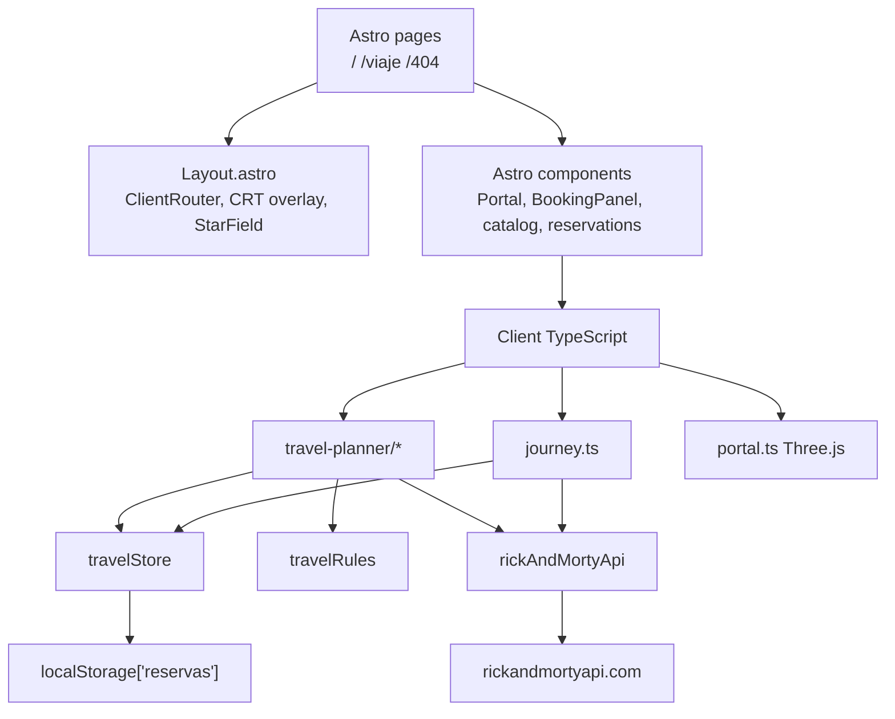

# PortalTrip frontend

Browser app for an interdimensional travel desk. You pick a Rick and Morty location,
choose up to three living companions, get a quote, and keep the booking on this
machine. Starting a trip opens a journey log built from the same catalog.

This repository is the UI. The Java API is
[`Prgm-code/portaltrip`](https://github.com/Prgm-code/portaltrip). The planner still
loads catalog data from the public [Rick and Morty API](https://rickandmortyapi.com/).
Reservations are stored in the browser, not on the Spring service.

Live demo: [hito2-dl.vercel.app](https://hito2-dl.vercel.app)

## Architecture

Astro prints the first HTML. After that, the session is vanilla TypeScript: DOM
events, `fetch`, and a Zustand store. There is no React tree and no form library.
Vite is the bundler Astro already ships.

```text
Browser
├── Astro pages          file routes, first paint
├── Astro components     static markup and slots
├── Client scripts       events, rendering, WebGL
├── Domain models        enums and interfaces
├── Travel rules         quote + booking validation
├── Zustand store        session state, persist reservations
└── API client           fetch + timeout + typed errors
        └── rickandmortyapi.com
```



### Rendering split

| Layer | Lives in | Job |
| :--- | :--- | :--- |
| Routes | `src/pages/` | `/` planner, `/viaje` journey log, `/404` |
| Shell | `src/layouts/Layout.astro` | document, View Transitions `ClientRouter`, starfield, CRT overlay, jump flash |
| Markup | `src/components/` | header, booking form, catalog, reservations, portal canvas host |
| Client boot | `src/scripts/app.ts`, `src/scripts/journey.ts` | start the planner or the log after each `astro:page-load` |
| Planner | `src/scripts/travel-planner/` | form, catalog paging, quotes, reservation actions |
| Scene | `src/scripts/portal.ts`, `src/scripts/starfield.ts` | slime portal (Three.js + custom shaders) and warp field (2D canvas) |
| Transitions | `src/scripts/portal-jump.ts`, `src/styles/transitions.css` | origin of the jump, shared `journey-stage` name, CRT persist |
| DOM factories | `src/ui/` | catalog cards, errors, journey view. Untrusted text goes through `textContent` |
| Domain | `src/models/` | `TripType`, `RiskLevel`, `ReservationStatus`, `Reservation`, Rick and Morty types |
| Rules | `src/utils/travelRules.ts` | quote breakdown and booking checks |
| State | `src/stores/travelStore.ts` | Zustand vanilla store |
| Network | `src/services/` | `fetch`, 8s timeout, `AbortController`, loading counter, `?apiError=` preview |

Internal imports use path aliases from `tsconfig.json` (`models/*`, `services/*`,
`stores/*`, and the rest). Relative `../../` climbs are not the convention here.

### Data flow

1. `Layout.astro` mounts the shell. `ClientRouter` keeps the CRT overlay and jump
   flash across navigations (`transition:persist`).
2. On `/`, `scripts/app.ts` waits for `#booking-form`, then `initializeApp()`.
   Listeners bind once. Catalog and living characters load in parallel with
   `Promise.all`.
3. The form is the source of the draft. `readDraft()` uses `FormData`.
   `validateReservation()` runs before `addReservation()`.
4. Only `reservations` persist. The storage adapter writes a JSON array to
   `localStorage["reservas"]`, not the default Zustand envelope.
5. `startReservation()` moves `CONFIRMED → IN_PROGRESS` and navigates to `/viaje`.
   `portal-jump.ts` records the click origin, flashes the viewport, and names the
   reservation card `journey-stage` so View Transitions can morph it into the log.
6. `/viaje` reads the in-progress booking from the store, then fetches location,
   residents, and episodes for the log UI.

Reservation states match the API:

```text
CONFIRMED → IN_PROGRESS → COMPLETED
    │              │
    └──────────────┴──→ CANCELLED
```

`COMPLETED` and `CANCELLED` are terminal. The store ignores illegal transitions.

### Why this shape

The catalog is remote and flaky. The booking is local and must survive a refresh.
Keeping `fetch` in `services/` and persistence in `travelStore` means the planner
can retry a 429 without rewriting the form. Astro is here for pages, View
Transitions, and the first HTML. The planner is still a DOM app on purpose: typed
events, no virtual DOM, no extra runtime.

Quote math (base 1200, trip multipliers, station surcharge, insurance 190 per
passenger, risk from resident count) lives in `travelRules.ts` so it can stay in
sync with [`portaltrip`](https://github.com/Prgm-code/portaltrip). Wiring this UI
to that API is future work. Until then the browser is the system of record.

## Stack

- Astro 7 and Vite
- TypeScript, `astro/tsconfigs/strict`
- Zustand 5 (vanilla + persist)
- Tailwind CSS 4
- Three.js for the portal disc
- Biome for format and lint
- [Rick and Morty API](https://rickandmortyapi.com/) for catalog reads

## Getting started

Requires Node.js 24 and pnpm 10.

```bash
pnpm install
pnpm dev
```

Open `http://localhost:4321`. npm scripts (`npm install`, `npm run dev`) work if
you do not use pnpm.

```bash
pnpm check      # astro check && biome check
pnpm build      # check, then astro build
pnpm preview    # serve dist/
pnpm format     # biome format --write .
```

Force catalog error UI without editing code:

```text
http://localhost:4321/?apiError=404
http://localhost:4321/?apiError=429
http://localhost:4321/?apiError=500
```

## Open source policy

PortalTrip frontend is open source under the [MIT License](LICENSE).

You may use, copy, modify, merge, publish, distribute, sublicense, and sell the
software, provided the copyright notice and license text stay with the source.
Contributions sent through pull requests are accepted under the same license.
There is no CLA.

What we will merge:

- Bug fixes, tests, and accessibility patches
- Documentation that matches the code
- Features discussed in an issue when they keep the Astro + vanilla TypeScript split

What we will not merge:

- A second UI runtime (React, Vue, Svelte) for the planner
- Persistence format changes without a migration plan for `localStorage["reservas"]`
- Secrets, personal catalog dumps, or generated `dist/` / `node_modules/`

Rick and Morty names, characters, and imagery belong to their owners. This project
is a fan-made client of the unofficial [Rick and Morty API](https://rickandmortyapi.com/).
It is not affiliated with Adult Swim, Cartoon Network, or the API authors. Do not
use this repo to ship trademarked branding as if it were official.

Security issues that are not a public bug report should go to the repository owner
([@Prgm-code](https://github.com/Prgm-code)) in private. Do not open a public issue
for credentials or exploit detail.

## License

[MIT](LICENSE). Copyright (c) 2026 Prgm-code.

## Code of conduct

Participation is governed by the [Contributor Covenant](CODE_OF_CONDUCT.md).
Harassment, personal attacks, and publishing private information are out of
scope for this project. Report incidents privately to
[@Prgm-code](https://github.com/Prgm-code) or through
[GitHub's abuse reporting](https://docs.github.com/en/communities/maintaining-your-safety-on-github/reporting-abuse-or-spam).

## Contributing

Read [CONTRIBUTING.md](CONTRIBUTING.md) before you open a pull request.

Short version: fork from `main`, keep the patch small, run `pnpm check` and
`pnpm build`, describe the risk to persistence or navigation if you touch those
paths. Issues are welcome. So are reviews from people who did not write the code.
