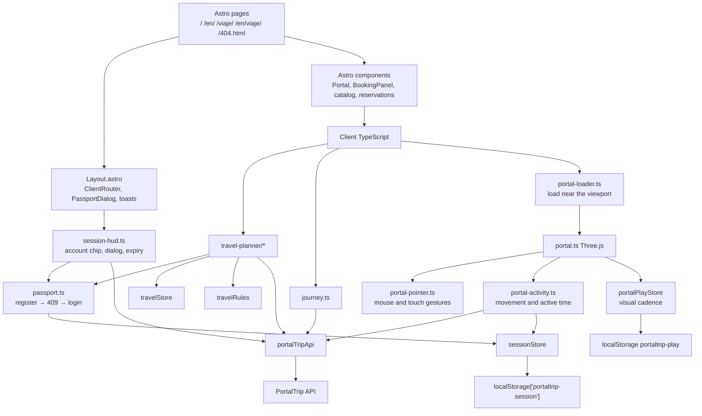

# PortalTrip frontend

Browser app for an interdimensional travel desk. You pick a Rick and Morty location,
choose up to three living companions, get a quote, and buy the trip with the credits
of your PortalTrip passport. Starting a trip opens a journey log built from the same
catalog.

This repository is the UI. The Java API is
[`Prgm-code/portaltrip`](https://github.com/Prgm-code/portaltrip): it serves the
catalog, issues the JWT passport, grants the welcome credits and owns every
reservation and portal reward. The browser persists the session and visual play cadence;
reward eligibility and amounts are validated by the API.

## 🌐 Live deployment

* **Web app:** https://portaltrip.prgm.codes
* **API:** https://portaltrip-api.prgm.codes (`/health` for the status check)

Both run on Coolify from this repository and [Prgm-code/portaltrip](https://github.com/Prgm-code/portaltrip); see the deployment section below.

## 🔌 Backend for this frontend

**This frontend works with the PortalTrip API backend.** GitHub repository:
**https://github.com/Prgm-code/portaltrip**

The UI consumes that API at `http://localhost:8080` with no configuration: download
both repositories and follow the local setup guide below. To target another URL set
`PUBLIC_API_URL` (see `.env.example`).

---

# 🎫 Enterprise Booking System - Full-Stack Integration

> **Final Challenge · Java Course · Globant Talento Ready · Desafío Latam.**
> PortalTrip is the course's full-stack capstone project: a Java/Spring Boot REST API backed by PostgreSQL and a TypeScript/Astro frontend, delivered as two repositories that connect locally with no extra configuration.

This repository is the **frontend** of the PortalTrip capstone project. The backend lives in [Prgm-code/portaltrip](https://github.com/Prgm-code/portaltrip).

## 🛠️ Tech Stack

* **Backend:** Java 26, Spring Boot 4.1.1, Spring Data JPA, Hibernate, Spring Security (JWT HS256), OpenAPI/Swagger (springdoc 3.1.0).
* **Frontend:** strict TypeScript 6 (zero `any`, Biome `noExplicitAny: error`), Astro 7.1 on Vite 8, native ESM, semantic HTML5/CSS3, Zustand 5, Tailwind CSS 4, Three.js.
* **Infrastructure:** Docker Compose, PostgreSQL 17 Alpine, multi-stage Dockerfile (Node 24 + nginx).
* **Quality and Testing:** JUnit, Mockito and JaCoCo in the API; `astro check`, Biome 2 and Node.js tests for portal activity, pointer input and the starfield in the UI.

### Versions and configuration

| Layer | Technology | Version |
| :--- | :--- | :--- |
| Backend | Java (Temurin) | 26 |
| Backend | Spring Boot | 4.1.1 |
| Backend | springdoc-openapi (Swagger UI) | 3.1.0 |
| Database | PostgreSQL (Docker `postgres:17-alpine`) | 17 |
| Frontend | Node.js / pnpm (`package.json`) | 24 / 11.25.0 |
| Frontend | Astro (on Vite 8.2) | 7.1.6 |
| Frontend | TypeScript (`astro/tsconfigs/strict`, zero `any`) | 6.0.3 |
| Frontend | Tailwind CSS | 4.3.3 |
| Frontend | Zustand | 5.0.14 |
| Frontend | Three.js | 0.185.1 |
| Frontend | Biome (lint + format) | 2.5.7 |
| Infrastructure | Docker Compose in the backend repository; frontend `Dockerfile` | Compose v2 |

Frontend dependency versions come from [package.json](package.json) and [pnpm-lock.yaml](pnpm-lock.yaml).
Backend dependency versions and coverage belong to the [API repository](https://github.com/Prgm-code/portaltrip).

---

## 🔗 Reference Repositories

* Domain Core / Milestone 1: https://github.com/sebavidal10/neonpulse-ticketera
* Spring Boot Backend / Milestone 4: https://github.com/sebavidal10/neonpulse-api-springboot
* Vite + TS Frontend / Milestone 2: https://github.com/sebavidal10/neonpulse-frontend

---

## Local setup guide

No `.env` file is needed: the API `dev` profile ships defaults for the database, the JWT key and CORS (`http://localhost:4321`), and the UI points to `http://localhost:8080`. Requires Docker, Node.js 24 and pnpm 11.25.0 (`npm install -g pnpm@11.25.0`). Java 26 is only needed when running or testing the backend outside Docker.

### 1. Start the Relational Database

```bash
cd portaltrip
docker compose up -d postgres
```

PostgreSQL is now listening on `localhost:5432` (`rickandmorty` / `rick` / `morty`) with the catalog and the reservation schema loaded automatically.

### 2. Run the Automated Tests

```bash
./mvnw clean test
```

The backend tests run against in-memory H2; Docker is not required for this step. See the backend test output for the current test count.

### 3. Start the Backend Microservice

```bash
./mvnw spring-boot:run
```

* REST API: http://localhost:8080/api/v1/reservations
* Swagger UI (dev profile): http://localhost:8080/swagger-ui.html
* Healthcheck: http://localhost:8080/health

All-in-one alternative with Docker: `docker compose up -d --build` starts PostgreSQL and the API in a single command.

### 4. Start the Web Frontend

```bash
cd ../portaltrip-frontend
pnpm install
pnpm dev
```

* Web App: http://localhost:4321

npm also works (`npm install`, `npm run dev`). With both repositories downloaded side by side there is nothing to configure: the UI targets `http://localhost:8080` and the API accepts the `http://localhost:4321` origin by default.

Full cycle: create your passport from the header button (email and password), pick a destination, request a quote and confirm the reservation. The API stores it in PostgreSQL and the reservations list refreshes in the UI without reloading the page. `pnpm build` runs `astro check`, Biome and the production build. Run the Node.js test suite separately, as shown under [development commands and tests](#development-commands-and-tests).

The backend allows `http://localhost:4321` by default. Keep Astro on that port;
`http://localhost:4322` is a different origin and needs its own CORS configuration.

| Local service | How it runs | Port |
| :--- | :--- | :--- |
| Frontend | `pnpm dev` in this repository | `4321` |
| API | Backend Compose service `app`, or Spring Boot locally | `8080` |
| PostgreSQL | Backend Compose service `postgres` | `5432` |

The frontend Nginx container is for testing the production image, not for the usual
local development setup. Do not run it alongside Astro on port 4321. If Astro reports
that the port is occupied, inspect the listener and containers before starting another
instance:

```bash
ss -ltnp 'sport = :4321'  # Linux
docker ps
```

If the listener is the frontend container from the image-test command below, stop that
specific container, then run Astro again:

```bash
docker stop portaltrip-frontend
pnpm dev --port 4321
```

`pn dev` can be used if you have a local wrapper for pnpm; the repository scripts use
`pnpm dev`. A red uplink in the header means the browser could not confirm API health.

---

## ☁️ Deploying to Coolify (or any Docker host)

The repository ships a multi-stage `Dockerfile` (build with Node 24 and pnpm, served
by nginx on port 80) and `nginx.conf`.

1. In Coolify create an application from this repository with **Build Pack: Dockerfile**.
2. Add the variable `PUBLIC_API_URL=https://<your-api-domain>` and mark it as a
   **Build Variable**: Astro embeds the URL in the bundle during `pnpm build`.
3. Exposed port: `80`. Assign the frontend domain.
4. In the API add that domain to `APP_CORS_ALLOWED_ORIGINS` (see the backend README).

The Dockerfile currently bootstraps pnpm 10.34.5, while `package.json` declares
pnpm 11.25.0 for the project. Keep both files in view when updating the toolchain.

To test the production image locally, stop Astro first so port 4321 is free:

```bash
docker build --build-arg PUBLIC_API_URL=http://localhost:8080 -t portaltrip-frontend .
docker run --rm --name portaltrip-frontend -p 127.0.0.1:4321:80 portaltrip-frontend
```

`nginx.conf` uses relative redirects (`absolute_redirect off`) to preserve the
browser's host and published port when a route receives a trailing slash.

---

## Architecture

Astro prints the first HTML. After that, the session is vanilla TypeScript: DOM
events, `fetch`, and three Zustand stores. There is no React tree and no form library.
Vite is the bundler Astro already ships.

```text
Browser
├── Astro pages          file routes, first paint
├── Astro components     static markup, passport dialog, slots
├── Client scripts       events, rendering, session HUD, WebGL
├── Domain models        enums, labels and API shapes
├── Travel rules         instant quote + local validation
├── Zustand stores       travelStore (catalog, draft, view) · sessionStore (JWT, balance) · portalPlayStore (play cadence)
└── API client           fetch + timeout + envelope + bearer + typed errors
        └── PortalTrip API (/api/v1)
```



### Rendering split

| Layer | Lives in | Job |
| :--- | :--- | :--- |
| Routes | `src/pages/` | `/` and `/en/` planner; `/viaje/` and `/en/viaje/` journey log; `/404.html` |
| Shell | `src/layouts/Layout.astro` | document, View Transitions `ClientRouter`, starfield, CRT overlay, jump flash, passport dialog, toast region |
| Markup | `src/components/` | header with account chip, booking form with passport step, catalog, reservations, portal canvas host |
| Client boot | `src/scripts/app.ts`, `src/scripts/journey.ts`, `src/scripts/session-hud.ts` | start the planner or the log after each `astro:page-load`; the HUD runs on every page |
| Passport | `src/scripts/passport.ts` | register with fallback to login, passport mode switching, field reading |
| Planner | `src/scripts/travel-planner/` | form, local catalog search and paging, instant quotes, purchase with idempotency, reservation actions |
| Scene | `src/scripts/portal-loader.ts`, `src/scripts/portal.ts`, `src/scripts/starfield.ts` | lazy-loaded slime portal (Three.js + custom shaders) and warp field (2D canvas) |
| Transitions | `src/scripts/portal-jump.ts`, `src/styles/transitions.css` | origin of the jump, shared `journey-stage` name, CRT persist |
| DOM factories | `src/ui/` | catalog cards, errors, journey view. Untrusted text goes through `textContent` |
| Domain | `src/models/` | `TripType`, `RiskLevel`, `ReservationStatus` (API codes plus Spanish labels), `Reservation`, catalog types, auth types |
| Rules | `src/utils/travelRules.ts` | instant quote breakdown, booking and passport checks, credit formatting |
| State | `src/stores/travelStore.ts`, `src/stores/sessionStore.ts`, `src/stores/portalPlayStore.ts` | catalog/draft in memory; session and play cadence persisted |
| Portal activity | `src/scripts/portal-pointer.ts`, `src/scripts/portal-activity.ts`, `src/scripts/portal-motion.ts` | mouse/touch input, measured movement, sequential API requests, session-safe rewards and gradual motion |
| Languages | `src/i18n/` | Spanish by default, English under `/en/`, localized URLs, dates and CR amounts |
| Network | `src/services/portalTripApi.ts` | `fetch`, 8s timeout, `AbortController`, envelope unwrapping, bearer header, `Idempotency-Key`, `?apiError=` preview |

Internal imports use path aliases from `tsconfig.json` (`models/*`, `services/*`,
`stores/*`, and the rest). Relative `../../` climbs are not the convention here.

### Data flow

1. `Layout.astro` mounts the shell. `ClientRouter` keeps the CRT overlay and jump
   flash across navigations (`transition:persist`). `session-hud.ts` hydrates the
   session, paints the account chip and refreshes the balance with `GET /users/me`.
2. On `/`, `scripts/app.ts` waits for `#booking-form`, then `initializeApp()`.
   Listeners bind once. `GET /locations` and `GET /characters` load in parallel and
   stay cached for the session; search and paging run in the browser. The page reads
   like an airline desk: hero with the welcome-credit invite, a search deck (origin,
   destination, date, passengers), featured routes with starting fares, then the
   results column next to the checkout console.
3. The form is the source of the draft. `readDraft()` uses `FormData`.
   `validateReservation()` runs before anything reaches the network. The quote shown
   while typing is computed locally with the same rules as the API.
4. Without a session the form shows the passport step. Submitting calls
   `POST /auth/register`; a `409` flips the step to login and calls
   `POST /auth/login`. The response carries the JWT and the welcome credits.
5. `POST /reservations` is sent with an `Idempotency-Key` bound to the exact request
   body. Retries reuse the key, so the balance is never charged twice. The response
   returns the reservation and `remainingBalance`.
6. `localStorage["portaltrip-session"]` stores the token, expiry and profile.
   `localStorage["portaltrip-play"]` separately stores each user's visual play cadence.
   It cannot authorize rewards. A `401` clears the session and reopens the passport dialog.
7. The reservation link opens `/viaje/?id=…` or `/en/viaje/?id=…`. Its relative URL
   keeps the current origin and port, and includes the final slash to avoid a directory
   redirect. `portal-jump.ts` records the click
   origin, adds `html.jumping` so cards and panels vanish toward the portal while the
   starfield warps (the canvas has its own `view-transition-name`, so it stays live
   behind both snapshots), delays the loader until the exit finishes, flashes the
   viewport, and names the reservation card `journey-stage` so View Transitions can
   morph it into the log.
8. The journey page reads the reservation from `GET /reservations/{id}`. Only a
   `CONFIRMED` reservation calls `startReservation()` with `PATCH .../start` to become
   `IN_PROGRESS`; continuing an in-progress trip does not start it again. It builds the log from the cached catalog
   plus `GET /episodes`. Completing the trip calls `PATCH .../complete`.

Reservation states match the API:

```text
CONFIRMED → IN_PROGRESS → COMPLETED
    │
    └──→ CANCELLED (refunds the total)
```

`COMPLETED` and `CANCELLED` are terminal. The API rejects illegal transitions with
`409`; cancelling is only offered for confirmed reservations.

### Why this shape

The API is the system of record for money and reservations, so the browser never
invents a booking. Keeping `fetch` in `services/` and the session in `sessionStore`
means the planner can recover from an expired token without losing the draft. Astro
is here for pages, View Transitions, and the first HTML. The planner is still a DOM
app on purpose: typed events, no virtual DOM, no extra runtime.

Quote math (base 1200, trip multipliers, station surcharge, insurance 190 per
passenger, risk from resident count) lives in `travelRules.ts` so the price updates
on every keystroke. It mirrors `QuoteCalculator` in
[`portaltrip`](https://github.com/Prgm-code/portaltrip); the total actually charged
is the one returned by the API.

The passport asks for a password because the API requires one (8 to 64 characters).
It is a single field with a show/hide toggle, asked once, in the same card as the
trip. Reservations saved by the previous local-only version under
`localStorage["reservas"]` cannot be imported (the API would charge them), so the
reservations panel shows them once as a local archive that can be discarded.

## Stack

- Astro 7 and Vite
- TypeScript, `astro/tsconfigs/strict`
- Zustand 5 (vanilla + persist)
- Tailwind CSS 4
- Three.js for the portal disc
- Biome for format and lint
- [PortalTrip API](https://github.com/Prgm-code/portaltrip) for catalog, passport, credits and reservations

## Development commands and tests

Use Node.js 24 and pnpm 11.25.0. Follow the [local setup guide](#local-setup-guide)
to start the backend and Astro. `pnpm preview` serves an existing `dist/` build;
it is not the development server and also needs a free port.

```bash
pnpm test:portal # 8 activity and motion tests
node --experimental-vm-modules --test tests/*.test.mjs # all 15 frontend tests
pnpm check      # astro check && biome check .
pnpm build      # check, then astro build; does not run the Node.js tests
pnpm preview    # serve dist/
pnpm format     # biome format --write .
```

| Suite | Tests | Coverage |
| :--- | :--- | :--- |
| `tests/portal-activity.test.mjs` | 8 | measured activity, retries, session changes, hidden pages and gradual recovery |
| `tests/portal-pointer.test.mjs` | 4 | mouse/touch input, single-finger capture, bounds, cancellation and cleanup |
| `tests/starfield.test.mjs` | 3 | initial paint, ambient redraw limit, reduced motion and visibility changes |

Force catalog error UI without editing code:

```text
http://localhost:4321/?apiError=404
http://localhost:4321/?apiError=429
http://localhost:4321/?apiError=500
```

## Interface, loading and motion

- The mobile header keeps its actions visible; the title precedes the portal. Layouts
  have been checked from 320 to 1440 CSS pixels in Spanish and English.
- Catalog metadata uses larger text and booking/pagination controls have larger touch
  targets. The catalog/reservations tabs support arrow keys, Home and End.
- Quotes, starting fares and account balances use `CR`, with locale-specific number
  formatting. They are not displayed as USD.
- The title keeps its glitch effect. Panel backgrounds are more opaque, portal glow
  is softer, and the global CRT overlay no longer flickers or sweeps over the text.
- `portal-loader.ts` imports Three.js when the canvas approaches the viewport. During
  normal loading, the canvas remains transparent and no fallback wheel is rendered.
  The CSS rings are created only if WebGL initialization fails.
- The WebGL portal stops rendering offscreen or in a hidden tab. A `ResizeObserver`
  updates canvas dimensions only when they change. Navigation disposes the renderer,
  geometry, materials, textures, observers and listeners.
- The starfield uses elapsed time and redraws at about 30 fps in ambient mode. During
  the warp effect it uses animation-frame updates. The warp target returns to rest
  100 ms after `astro:page-load`, then eases down more quickly than before.
- The original 560 ms exit wait and page-transition choreography remain in place.
  The shorter warp tail does not remove that wait or change the portal loading logic.
- Reduced motion stops recurring WebGL/starfield animation and shortens CSS motion.
  Portal activity and numerical connection updates remain available.

Three.js still produces a chunk-size warning in the production build. Lazy loading
defers that cost; it does not remove the dependency. No production Core Web Vitals
improvement has been measured.

## Portal interaction and rewards

Only authenticated travelers can encounter a portal failure. Each failure chooses a
new target around 38–62% and its own descent speed. The level eases toward its target;
it does not jump down or snap upward when a reward arrives. Movement provides immediate
visual feedback while server-confirmed progress drives recovery. The interactive portal
uses a `pointer` cursor while help is needed.

The instruction sits outside the portal rather than over its interaction area:

- With a mouse, move across the portal without holding a button.
- On touch devices, slide one finger across the unstable portal. The copy switches
  to the finger instruction for a coarse primary pointer.
- Only the unstable portal uses `touch-action: none`; touching the rest of the page
  still scrolls. Releasing or cancelling the gesture releases pointer capture.
- Additional fingers, untrusted events and movement outside the portal bounds do
  not add activity. Mouse and touch feed the same server-validated reward cycle.

`portalPlayStore` increases failure frequency gradually after successful help, with a
bounded interval of roughly 8–21 seconds and heat that decays over time. This is a visual
rule only. Clearing local storage cannot reset server-side reward fatigue.

### What the browser sends

1. Open/resume a cycle with `POST /api/v1/users/me/portal-activity/start`.
2. About once per second, send `cycleId`, `sequence`, `activeMs` and `distance` to
   `POST /api/v1/users/me/portal-activity`, with the session's bearer token.
3. Use the returned `nextSequence` for the next sample. A failed request retries the
   same sample. Only one request is in flight.
4. On a positive `payout`, update the balance from the server and show a short credit
   toast and the animated counter. Ignore responses belonging to a previous session.

Time is counted between moving events no more than 200 ms apart. Distance is normalized
by the portal width. A stationary pointer or one brief pass does not qualify. Hidden-page
activity is discarded. Expired cycles resume automatically; network errors show a temporary
notice. The client never sends an amount and does not call a free-claim endpoint.

The API requires at least 2.4 active seconds and 1.5 portal widths. Reward amounts range
from **200 to 1620 credits**: a Gaussian base centered on 650, up to 50% for movement and
20% for active time, then server-side fatigue. Longer idle time is not active time.
An incomplete sample returns zero, which is not a paid reward. The server owns cooldowns,
rolling history, cycle validation and protection against duplicate payouts.

### Database upgrades

For a new local database, follow the [local setup guide](#local-setup-guide).
The backend initializes its seed and reward tables on a fresh database volume.

For an existing database, apply the backend's `db/patch-portal-stipends.sql` before
upgrading. In Coolify, run the patch in the PostgreSQL container, deploy the updated
backend, then build/deploy this frontend. See the backend README for the SQL commands.
The old `/users/me/portal-stipend` route is no longer supported.

### Validation

Run the complete command under [development commands and tests](#development-commands-and-tests).
`pnpm test:portal` only runs the activity/motion file; it does not include pointer or
starfield tests. The VM-module flag lets those tests isolate browser dependencies.

For a manual check, sign in and wait for a failure. Move the mouse across the portal,
then repeat on a touch device by sliding one finger. Check that the instruction does
not cover the portal, the touch gesture does not scroll the page, and the returned
reward updates the balance once. A stationary pointer or finger must not earn activity.

Reload the home page with a slow connection to verify that the wheel is absent during
normal loading. Start or continue a reservation and check that the journey URL keeps
`:4321` locally, that the original transition is intact and that the warp tail is brief.

## Open source policy

PortalTrip frontend is open source under the [MIT License](LICENSE).

You may use, copy, modify, merge, publish, distribute, sublicense, and sell the
software, provided the copyright notice and license text stay with the source.
Contributions sent through pull requests are accepted under the same license.
There is no CLA.

What we will merge:

- Bug fixes, tests, and accessibility patches
- Documentation that matches the code
- Features discussed in an issue when they keep the Astro + vanilla TypeScript split

What we will not merge:

- A second UI runtime (React, Vue, Svelte) for the planner
- Persistence format changes without a migration plan for `localStorage["portaltrip-session"]`
- Secrets, personal catalog dumps, or generated `dist/` / `node_modules/`

Rick and Morty names, characters, and imagery belong to their owners. This project
is a fan-made client; the catalog is a copy of the unofficial
[Rick and Morty API](https://rickandmortyapi.com/) served by PortalTrip API.
It is not affiliated with Adult Swim, Cartoon Network, or the API authors. Do not
use this repo to ship trademarked branding as if it were official.

Security issues that are not a public bug report should go to the repository owner
([@Prgm-code](https://github.com/Prgm-code)) in private. Do not open a public issue
for credentials or exploit detail.

## License

[MIT](LICENSE). Copyright (c) 2026 Prgm-code.

## Code of conduct

Participation is governed by the [Contributor Covenant](CODE_OF_CONDUCT.md).
Harassment, personal attacks, and publishing private information are out of
scope for this project. Report incidents privately to
[@Prgm-code](https://github.com/Prgm-code) or through
[GitHub's abuse reporting](https://docs.github.com/en/communities/maintaining-your-safety-on-github/reporting-abuse-or-spam).

## Contributing

Read [CONTRIBUTING.md](CONTRIBUTING.md) before you open a pull request.

Short version: fork from `main`, keep the patch small, run `pnpm check` and
`pnpm build`, describe the risk to persistence or navigation if you touch those
paths. Issues are welcome. So are reviews from people who did not write the code.
