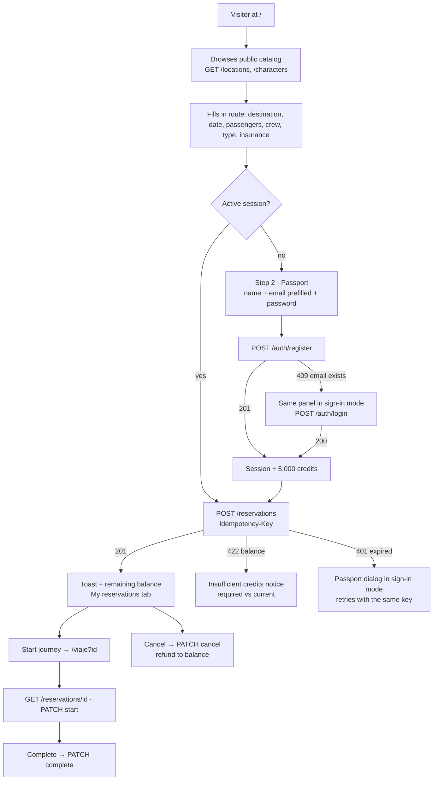

# PortalTrip API integration plan

Date: 2026-09-03. Backend analyzed: `Prgm-code/portaltrip` (local copy at
`/home/prgm/code/Java/portaltrip/portaltrip`, commit `eb90af1`).

> **Status (2026-09-03):** phases 0 through 5 are implemented in this repository and verified in
> the browser against the local API: catalog from the API, quick registration inside the
> booking form with fallback to sign-in, charging with idempotency, balance in the HUD,
> cancellation with refund, journey log against the API, and session expiry that reopens
> the passport dialog. Optional pending work: unit tests with Vitest and the recommended
> backend adjustments.

Main goal: a person who arrives without an account can **register in the same booking
form, receive the welcome credits, and buy in a single step**. The rest of the plan
reorganizes the frontend so the API becomes the source of truth (session, balance,
reservations, catalog) without losing the HUD visual theme.

---

## 1. What the backend offers today

Stack: Java 26, Spring Boot 4.1.1, PostgreSQL 17, Docker Compose. Every response under
`/api/v1` is wrapped:

```json
{ "status": 201, "message": "Account created successfully", "data": { ... }, "timestamp": "..." }
```

### 1.1 Authentication and account

| Method | Path | Auth | Input | Output (`data`) |
| :--- | :--- | :--- | :--- | :--- |
| `POST` | `/auth/register` | public | `fullName` (3-100), `email`, `password` (8-64) | `{ tokenType: "Bearer", accessToken, expiresAt, user }` |
| `POST` | `/auth/login` | public | `email`, `password` | same as register |
| `GET` | `/users/me` | Bearer | none | `{ id, email, fullName, balance }` |

- Registration **credits `REGISTRATION_CREDIT` (5000.00 by default) and returns the JWT
  in the same response**. No second login is needed, which is exactly what quick
  registration requires.
- A duplicate email returns `409` with a generic message. Invalid credentials return `401`.
- JWT HS256, **TTL 30 min**, no refresh and no logout. Claims: `sub` (email), `user_id`,
  `roles`. The frontend has to handle expiry on its own.
- The server normalizes the email (trim + lowercase).

### 1.2 Catalog (public)

| Path | Returns |
| :--- | :--- |
| `GET /locations` | All 126 locations with `residentIds: number[]` |
| `GET /locations/{id}` | One location with `residentIds` |
| `GET /characters` | All 826 characters (summary: `origin`/`location` as `{id,name}`, `image`; **no `episodeIds`**) |
| `GET /characters/{id}` | Full character with `episodeIds` |
| `GET /episodes` | All 51 episodes with `characterIds` |
| `GET /episodes/{id}` | One episode with `characterIds` |

Differences from the Rick and Morty API the frontend consumes today:

- **No pagination and no query filters**. Listing is a single call; search and paging
  become local.
- **No batch lookup (`/character/1,2,3`)**. Compensated by caching the full character
  and episode lists in memory for the session.
- Relations arrive as **arrays of IDs**, not URLs. `getIdFromUrl` goes away.
- Renamed fields: `air_date` → `airDate`, `episode` (code) → `code`,
  `characters` → `characterIds`, `residents` → `residentIds`, `episode` → `episodeIds`.

### 1.3 Quotes and reservations

| Method | Path | Auth | Notes |
| :--- | :--- | :--- | :--- |
| `POST` | `/quotes` | public | `{ destinationId, passengers 1-8, tripType, insurance }`. Forces `insurance` when the dimension is `unknown`. |
| `POST` | `/reservations` | Bearer + header `Idempotency-Key: <uuid>` | Charges `quote.total` to the balance inside a transaction with a row lock. Returns `{ reservation, remainingBalance }`. |
| `GET` | `/reservations` | Bearer | Newest to oldest |
| `GET` | `/reservations/{id}` | Bearer | Only the user's own reservations |
| `PATCH` | `/reservations/{id}/start` | Bearer | `CONFIRMED → IN_PROGRESS` |
| `PATCH` | `/reservations/{id}/complete` | Bearer | `IN_PROGRESS → COMPLETED` |
| `PATCH` | `/reservations/{id}/cancel` | Bearer | Only from `CONFIRMED`; **refunds** and returns `{ reservation, remainingBalance }` |

Shape of `reservation`:

```json
{
  "id": "uuid", "number": "PT-2026-238413", "status": "CONFIRMED",
  "passengerName": "Morty Smith", "email": "morty@example.com",
  "destination": { "id": 1, "name": "Earth (C-137)" },
  "travelDate": "2030-12-20", "passengers": 2,
  "companions": [{ "id": 1, "name": "Rick Sanchez", "image": "https://..." }],
  "tripType": "exploration", "insurance": true, "comments": "",
  "quote": { "basePrice": 1200, "locationSurcharge": 0, "passengerSurcharge": 216,
             "tripSurcharge": 360, "insuranceCost": 380, "total": 2156, "risk": "LOW" },
  "createdAt": "...", "startedAt": null, "completedAt": null
}
```

Points that change the frontend design:

- `email` **is not sent**: it comes from the authenticated account. The current form
  field becomes the passport email (register/login), not the reservation email.
- `destination` only carries `{id, name}`; `companions` only `{id, name, image}`. To show
  dimension, type, species, etc. the frontend resolves them against the cached catalog.
- `status` and `risk` arrive as codes (`CONFIRMED`, `LOW`). Today the frontend enums
  store the Spanish label. Code and label get separated.
- `travelDate` must be strictly in the future according to the server clock.
- The quote rule is identical to `travelRules.ts`; the local calculation stays for an
  instant response and the server is treated as the authority.

### 1.4 Errors

| HTTP | When | `data` |
| :--- | :--- | :--- |
| `400` | Jakarta validation. `message` = `"field: message; field2: message"` | none |
| `401` | Token missing, invalid or expired (`"Authentication required"`) or failed login | none |
| `403` | Role without permission (does not apply today) | none |
| `404` | Resource not found or reservation belongs to another user | none |
| `409` | Duplicate email, idempotency key reused with a different body, invalid transition | none |
| `422` | Domain rule (`"Validation failed"`) | `string[]` with the errors |
| `422` | Insufficient balance | `{ required, current }` |
| `500` | Unexpected | none |

### 1.5 CORS and startup

- Allowed origins: `APP_CORS_ALLOWED_ORIGINS`, **default `http://localhost:5173`**.
  Astro serves on `4321`: it has to be added, plus the Vercel domain.
- Methods `GET, POST, PATCH, OPTIONS`; headers `Authorization, Content-Type,
  Idempotency-Key`; `allowCredentials: true`.
- `JWT_SECRET_BASE64` is required (`openssl rand -base64 32`).
- `docker compose up -d --build` starts API + PostgreSQL with the catalog loaded.
  Swagger at `http://localhost:8080/swagger-ui.html`, health at `/health`.

---

## 2. New application flow



Flow decisions:

1. **One form, two steps.** The booking form already asks for name and email. When
   there is no session, submitting expands the "Passport" step inside the same card
   with those fields prefilled and a single password field. The button reads
   "Create passport and book". The passenger name is used as the registration
   `fullName` (editable).
2. **The password is mandatory** because the backend requires it (8-64 characters). It
   is asked once, with no confirmation field, with a show/hide button. Generating
   passwords automatically is not recommended: the person could not sign in again.
3. **Registration with fallback to sign-in.** If the email already exists (`409`), the
   same panel switches to "You already have a passport, enter your password" mode
   without losing the draft.
4. **Local quote + server confirmation.** The price keeps being calculated live in the
   browser. On submit, the total charged is the one in the `201` response.
   Optional: call `POST /quotes` when destination/passengers change to show an
   "official quote" (useful to verify forced insurance).
5. **Idempotency.** A UUID is generated per purchase attempt and kept until the API
   responds `201`. Retries caused by the network or by an expired session reuse the
   same key, so the balance is not charged twice.
6. **Session.** Token, `expiresAt` and `user` in `localStorage["portaltrip-session"]`.
   On startup, if it has expired it is discarded; if it is still valid, `GET /users/me`
   refreshes the balance. Any `401` clears the session and opens the passport dialog
   in sign-in mode while keeping the screen state.
7. **Reservations on the server.** `localStorage["reservas"]` stops being the system
   of record. Old reservations cannot be imported (they would have to be charged), so
   they are shown once as a "local archive" with an option to discard them.

---

## 3. Frontend changes

### 3.1 Network layer and models

| File | Action |
| :--- | :--- |
| `src/services/portalTripApi.ts` | **New.** Base client: `PUBLIC_API_URL`, 8 s timeout, `AbortController`, loading counter, envelope unwrapping, `Authorization` injection from the session store, `Idempotency-Key` header. Typed functions: `register`, `login`, `getMe`, `getLocations`, `getLocation`, `getCharacters`, `getCharacter`, `getEpisodes`, `getQuote`, `createReservation`, `getReservations`, `getReservation`, `startReservation`, `completeReservation`, `cancelReservation`. |
| `src/services/portalTripApiError.ts` | Replaces `rickAndMortyApiError.ts`. Keeps `?apiError=` and the themed views, adds `401` ("Passport expired"), `409` ("Conflicting coordinates" / "This email already has a passport"), `422` with `errors[]` and with `{required, current}` ("Insufficient credits"), `400` with a field list. Exposes `status`, the server `message` and `data`. |
| `src/services/rickAndMortyApi.ts` | Delete. Images still point to the Rick and Morty CDN, but they come inside the backend data. |
| `src/models/catalog.ts` | Replaces `rick-and-morty.ts`: `Location{id,name,type,dimension,residentIds}`, `Character{id,name,status,species,type,gender,origin?,location?,image,episodeIds}`, `Episode{id,name,airDate,code,characterIds}`, `NamedRef`. |
| `src/models/reservation.ts` | `RiskLevel = 'LOW'|'MEDIUM'|'HIGH'` and `ReservationStatus = 'CONFIRMED'|...` with `riskLabels` / `statusLabels` maps in Spanish. `Reservation` takes the shape of the backend response. `ReservationDraft` loses `email`. New `ReservationRequest` (what gets sent) and `ReservationWithBalance`. |
| `src/models/auth.ts` | **New.** `UserProfile`, `AuthSession{accessToken,expiresAt,user}`, `RegisterRequest`, `LoginRequest`, `PassportMode = 'register'|'login'`. |
| `src/utils/travelRules.ts` | Uses `residentIds.length`; removes the email validation (no longer part of the reservation); adds `remainingAfter(balance, quote)`. |
| `.env.example` | `PUBLIC_API_URL=http://localhost:8080`. |

### 3.2 State

| File | Action |
| :--- | :--- |
| `src/stores/sessionStore.ts` | **New.** Zustand vanilla + persist in `localStorage["portaltrip-session"]`. State: `session`, `user`, `status: 'anonymous'|'authenticated'|'expired'`. Actions: `setSession`, `setBalance`, `clearSession`, `isExpired()`. Subscribers: header, balance card, reservations panel. |
| `src/stores/travelStore.ts` | No longer persists. `reservations` becomes an API cache. `locations` holds all 126; `filteredLocations` and `pageSize` are added. `draft` without `email`. `legacyReservations` loaded once from `localStorage["reservas"]` for the archive notice. `PlannerView` unchanged. |
| `src/scripts/travel-planner/context.ts` | Session caches: `charactersById`, `episodesById`, `locationsById`, loaded once. |

### 3.3 Planner logic

| File | Action |
| :--- | :--- |
| `src/scripts/travel-planner/auth.ts` | **New.** `ensureSession(draft)` orchestrates the Passport step: register → on `409`, switch to login → return the session. `handleUnauthorized()` opens the global dialog. `renderAccount()` renders the header chip and the balance card. `logout()`. |
| `src/scripts/travel-planner/booking.ts` | `submitReservation` → validate locally → `ensureSession` → `createReservation` with the attempt's idempotency key → update balance → toast with remaining balance → My reservations tab. Handles `422` balance, `422` domain, `401`, `409` idempotency. The Passport step is shown/hidden based on `sessionStore`. Third tile "Balance after the jump". |
| `src/scripts/travel-planner/catalog.ts` | Loads `GET /locations` and `GET /characters` once. Search (name, dimension, type) and client-side pagination (12 per page). Resident previews from `charactersById`. |
| `src/scripts/travel-planner/reservations.ts` | `loadReservations()` from the API when there is a session; locked state when there is none. Cancel → `PATCH cancel` → balance from `remainingBalance` → toast "Credits refunded". |
| `src/scripts/travel-planner/index.ts` | Startup: hydrate session → `GET /users/me` in parallel with the catalog → if there is a session, load reservations. |
| `src/scripts/journey.ts` | Requires a session (otherwise a themed message and a Sign in button). `GET /reservations/{id}`; if `CONFIRMED`, `PATCH start`. Scene data from `GET /locations/{id}` + character and episode caches. Complete button → `PATCH complete`. |
| `src/ui/appElements.ts` | `createReservationItem` resolves destination and companions against the catalog; uses `statusLabels`/`riskLabels`. |
| `src/ui/journeyElements.ts` | `episodeIds`/`characterIds` instead of URLs; a character's episodes are derived from `episodesById` by filtering `characterIds`. |
| `src/ui/authElements.ts` | **New.** DOM builders: Passport step, sign-in form, account chip, credits badge, locked reservations state, local archive notice. Untrusted text always goes through `textContent`. |

### 3.4 Components and visual structure

Everything reuses existing tokens and primitives (`.glass`, `.hud-label`, `.uplink`,
`.control`, `.btn`, `.view-tabs`, `.quote-tile`, `.empty-state`, the journey log
`<dialog>`). No new runtime.

| Component | Change |
| :--- | :--- |
| `Header.astro` | Right zone with two states. Without a session: `UplinkStatus` + ghost "Sign in" button + "Open portal" CTA. With a session: `.hud-account` chip (mono pill like `.uplink`, green dot, "MORTY · 5,000 CR") that opens a minimal menu: My reservations, Sign out. On `/viaje` the chip replaces the "Portal signal active" text. |
| `BookingPanel.astro` | Dynamic kicker "Jump console · Step 1 of 2 · Route" / "Step 2 of 2 · Passport". The email field is removed from the route block and moved to the Passport step. New `#passport-step` block (hidden by default): "+5,000 welcome credits" badge with `--green` glow, full name, email, password with show/hide, "I already have a passport" link. Quote grid with a third tile "Balance after the jump" (`.quote-tile.warn` in red if it goes negative). Closing note: "Reservation backed by the Citadel · charged in credits". |
| `PassportDialog.astro` | **New**, mounted in `Layout.astro` with `transition:persist`. `<dialog class="passport-dialog glass">` with "Create passport" / "I already have a passport" tabs (same style as `.view-tabs`). Opened by the header "Sign in" button, the locked reservations state and session expiry. |
| `ReservationsPanel.astro` | `.live-note` becomes "Synced with the Citadel". Locked state with `.empty-state` and a "Sign in" button. `.legacy-notice` for the local archive (shown once). |
| `DestinationCatalog.astro` | No markup changes. The type select is filled with the real catalog types. |
| `index.astro` | `hero-readout` adds the lines `PASSPORT · <name>` and `CREDITS · 5,000` when there is a session. |
| `UplinkStatus.astro` | Besides `navigator.onLine`, pings `GET /health` on load: "Citadel uplink · online / no signal". |
| `viaje.astro` | No structural changes; uses `Header mode="journey"` with the account chip. |
| `src/styles/auth.css` | **New.** `.passport-step`, `.credit-badge`, `.hud-account`, `.account-menu`, `.passport-dialog`, `.legacy-notice`, `.quote-tile.warn`, `.password-toggle`. Passport step entry animation with `toast-in` and `--ease-portal`. |

### 3.5 Documentation

- README: architecture diagram and table with `portalTripApi`, `sessionStore`, the
  passport flow; "Getting started" section with `.env`; updated persistence policy
  (`portaltrip-session`; `reservas` stays as a read-only archive).
- This document is linked from the README.

---

## 4. Minimal backend changes

Nothing blocks the integration. Configuration comes first, the rest are improvements.

1. **`.env`:** `APP_CORS_ALLOWED_ORIGINS=http://localhost:4321,https://hito2-dl.vercel.app`
   and a generated `JWT_SECRET_BASE64`.
2. Recommended: **batch lookup** `GET /characters?ids=1,2,3` and
   `GET /episodes?ids=`. Reduces the initial load of the journey log if the catalog
   ever grows. Today it is solved with the full cached lists.
3. Recommended: **`GET /characters` with `episodeIds`** or a longer token TTL
   (`JWT_TTL=PT2H`) so a purchase session does not expire halfway through the form.
4. Optional: `POST /auth/refresh` endpoint or httpOnly cookie. Until it exists, the
   token lives in `localStorage`.

---

## 5. Execution phases

| Phase | Deliverable | Verification |
| :--- | :--- | :--- |
| 0. Environment | Backend up with Docker, `.env` with CORS `4321`; frontend with `PUBLIC_API_URL`. | `curl /health`; `OPTIONS` preflight from `localhost:4321` returns `Access-Control-Allow-Origin`. |
| 1. Network and catalog | `portalTripApi`, themed errors, new models, public catalog from the API with local search and pagination. No auth yet. | `pnpm check`; catalog, previews and local quote work; `?apiError=500` still shows the themed screen. |
| 2. Passport | `sessionStore`, Passport step in the form, `PassportDialog`, header chip, expiry. | New registration → chip with 5,000 credits. Repeated email → switches to sign-in. Tampered token → "Passport expired" dialog. |
| 3. Purchase and reservations | Create with idempotency, list, cancel with refund, balance tile, local archive. | Purchase deducts the exact total; retry with the same key does not charge twice; cancel returns the total; insufficient balance shows `required/current`. |
| 4. Journey log | `/viaje` against the API: fetch, start, complete. | `CONFIRMED → IN_PROGRESS` on open; complete leaves `COMPLETED`; a cancelled one shows the themed error. |
| 5. Polish | Real uplink, README, visual review on mobile (460 px, 820 px), `pnpm build`. | Backend Bruno collection + full manual walkthrough. Accessibility Lighthouse with no regressions. |

Suggested tests for the repo (it has none today): Vitest for the error mappers, the
`register → 409 → login` logic, and idempotency key generation/persistence. They are
pure functions and stay isolated from the DOM.

---

## 6. Risks and open decisions

- **Password in quick registration.** Unavoidable with the current backend. Mitigation:
  a single field, "8 characters or more" message, no confirmation.
- **30-minute session without refresh.** `expiresAt` is stored; 2 minutes before expiry
  the header chip shows a warning. Every `401` response reopens the passport dialog
  without losing the draft or the idempotency key.
- **Token in `localStorage`.** Exposed to XSS like any SPA without an httpOnly cookie.
  All API text is inserted with `textContent` (a rule already in force in `ui/`).
- **Old reservations in the browser.** Not migrated to the server. Shown once as an
  archive and then discarded.
- **Future date.** The server validates against its own UTC clock; the input `min`
  is still tomorrow. A `400` mentioning `travelDate` is shown in the form.
- **Passenger name vs account name.** Booking for someone else is allowed:
  `passengerName` is sent as is and `fullName` is prefilled with it only the first time.
