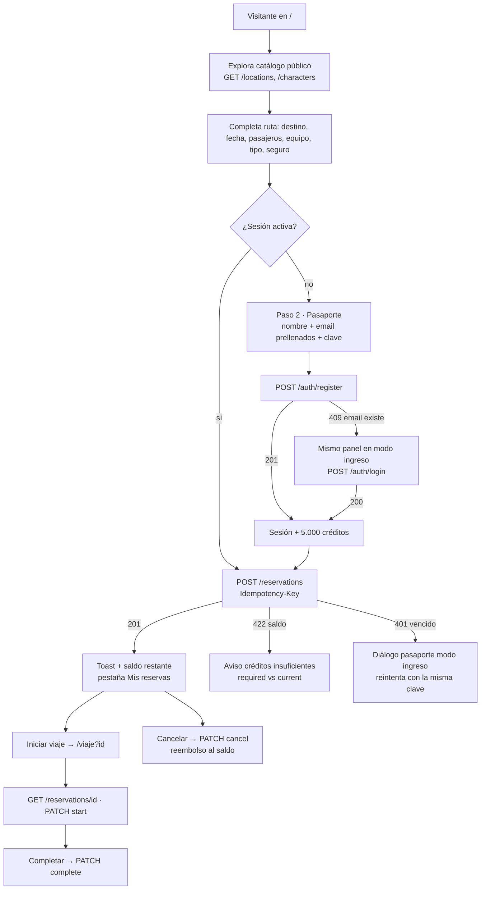

# Plan de integración con PortalTrip API

Fecha: 2026-09-03. Backend analizado: `Prgm-code/portaltrip` (copia local en
`/home/prgm/code/Java/portaltrip/portaltrip`, commit `eb90af1`).

> **Estado (2026-09-03):** fases 0 a 5 implementadas en este repositorio y verificadas en
> el navegador contra la API local: catálogo desde la API, registro rápido en la compra
> con retroceso a ingreso, cobro con idempotencia, saldo en el HUD, cancelación con
> reembolso, bitácora contra la API y expiración de sesión con reapertura del pasaporte.
> Pendiente opcional: pruebas unitarias con Vitest y los ajustes recomendados al backend.

Objetivo principal: que una persona que llega sin cuenta pueda **registrarse en el
mismo formulario de reserva, recibir los créditos de bienvenida y comprar en un solo
paso**. El resto del plan reordena el frontend para que la API sea la fuente de
verdad (sesión, saldo, reservas, catálogo) sin perder el tema visual del HUD.

---

## 1. Qué ofrece el backend hoy

Stack: Java 26, Spring Boot 4.1.1, PostgreSQL 17, Docker Compose. Toda respuesta bajo
`/api/v1` viene envuelta:

```json
{ "status": 201, "message": "Account created successfully", "data": { ... }, "timestamp": "..." }
```

### 1.1 Autenticación y cuenta

| Método | Ruta | Auth | Entrada | Salida (`data`) |
| :--- | :--- | :--- | :--- | :--- |
| `POST` | `/auth/register` | pública | `fullName` (3-100), `email`, `password` (8-64) | `{ tokenType: "Bearer", accessToken, expiresAt, user }` |
| `POST` | `/auth/login` | pública | `email`, `password` | igual que register |
| `GET` | `/users/me` | Bearer | — | `{ id, email, fullName, balance }` |

- El registro **acredita `REGISTRATION_CREDIT` (5000.00 por defecto) y devuelve el JWT
  en la misma respuesta**. No hace falta un segundo login: es exactamente lo que
  necesita el registro rápido.
- Email duplicado responde `409` con mensaje genérico. Credenciales inválidas `401`.
- JWT HS256, **TTL 30 min**, sin refresh ni logout. Claims: `sub` (email), `user_id`,
  `roles`. El frontend debe manejar la expiración solo.
- El email se normaliza (trim + minúsculas) en el servidor.

### 1.2 Catálogo (público)

| Ruta | Devuelve |
| :--- | :--- |
| `GET /locations` | Las 126 ubicaciones con `residentIds: number[]` |
| `GET /locations/{id}` | Una ubicación con `residentIds` |
| `GET /characters` | Los 826 personajes (resumen: `origin`/`location` como `{id,name}`, `image`; **sin `episodeIds`**) |
| `GET /characters/{id}` | Personaje completo con `episodeIds` |
| `GET /episodes` | Los 51 episodios con `characterIds` |
| `GET /episodes/{id}` | Un episodio con `characterIds` |

Diferencias con Rick and Morty API que hoy consume el frontend:

- **No hay paginación ni filtros por query**. Listar es una sola llamada; búsqueda y
  páginas pasan a ser locales.
- **No hay consulta por lote (`/character/1,2,3`)**. Se compensa cacheando la lista
  completa de personajes y episodios en memoria durante la sesión.
- Las relaciones vienen como **arreglos de IDs**, no URLs. `getIdFromUrl` desaparece.
- Campos renombrados: `air_date` → `airDate`, `episode` (código) → `code`,
  `characters` → `characterIds`, `residents` → `residentIds`, `episode` → `episodeIds`.

### 1.3 Cotización y reservas

| Método | Ruta | Auth | Notas |
| :--- | :--- | :--- | :--- |
| `POST` | `/quotes` | pública | `{ destinationId, passengers 1-8, tripType, insurance }`. Fuerza `insurance` si la dimensión es `unknown`. |
| `POST` | `/reservations` | Bearer + header `Idempotency-Key: <uuid>` | Cobra `quote.total` al saldo dentro de una transacción con bloqueo de fila. Devuelve `{ reservation, remainingBalance }`. |
| `GET` | `/reservations` | Bearer | De más nueva a más antigua |
| `GET` | `/reservations/{id}` | Bearer | Solo reservas del usuario |
| `PATCH` | `/reservations/{id}/start` | Bearer | `CONFIRMED → IN_PROGRESS` |
| `PATCH` | `/reservations/{id}/complete` | Bearer | `IN_PROGRESS → COMPLETED` |
| `PATCH` | `/reservations/{id}/cancel` | Bearer | Solo desde `CONFIRMED`; **reembolsa** y devuelve `{ reservation, remainingBalance }` |

Forma de `reservation`:

```json
{
  "id": "uuid", "number": "PT-2026-238413", "status": "CONFIRMED",
  "passengerName": "Morty Smith", "email": "morty@example.com",
  "destination": { "id": 1, "name": "Earth (C-137)" },
  "travelDate": "2030-12-20", "passengers": 2,
  "companions": [{ "id": 1, "name": "Rick Sanchez", "image": "https://..." }],
  "tripType": "exploration", "insurance": true, "comments": "",
  "quote": { "basePrice": 1200, "locationSurcharge": 0, "passengerSurcharge": 216,
             "tripSurcharge": 360, "insuranceCost": 380, "total": 2156, "risk": "LOW" },
  "createdAt": "...", "startedAt": null, "completedAt": null
}
```

Puntos que cambian el diseño del frontend:

- `email` **no se envía**: sale de la cuenta autenticada. El campo del formulario
  actual pasa a ser el email del pasaporte (registro/login), no de la reserva.
- `destination` trae solo `{id, name}`; `companions` solo `{id, name, image}`. Para
  mostrar dimensión, tipo, especie, etc. se resuelve contra el catálogo cacheado.
- `status` y `risk` llegan como códigos (`CONFIRMED`, `LOW`). Hoy los enums del
  frontend guardan la etiqueta en español. Se separan código y etiqueta.
- `travelDate` debe ser estrictamente futura según el reloj del servidor.
- La regla de cotización es idéntica a `travelRules.ts`; se conserva el cálculo local
  para respuesta instantánea y se trata al servidor como autoridad.

### 1.4 Errores

| HTTP | Cuándo | `data` |
| :--- | :--- | :--- |
| `400` | Validación Jakarta. `message` = `"campo: mensaje; campo2: mensaje"` | — |
| `401` | Token ausente, inválido o vencido (`"Authentication required"`) o login fallido | — |
| `403` | Rol sin permiso (no aplica hoy) | — |
| `404` | Recurso o reserva ajena | — |
| `409` | Email duplicado, clave de idempotencia reutilizada con otro cuerpo, transición inválida | — |
| `422` | Regla de dominio (`"Validation failed"`) | `string[]` con los errores |
| `422` | Saldo insuficiente | `{ required, current }` |
| `500` | Inesperado | — |

### 1.5 CORS y arranque

- Orígenes permitidos: `APP_CORS_ALLOWED_ORIGINS`, **por defecto `http://localhost:5173`**.
  Astro sirve en `4321`: hay que agregarlo, más el dominio de Vercel.
- Métodos `GET, POST, PATCH, OPTIONS`; headers `Authorization, Content-Type,
  Idempotency-Key`; `allowCredentials: true`.
- `JWT_SECRET_BASE64` es obligatorio (`openssl rand -base64 32`).
- `docker compose up -d --build` levanta API + PostgreSQL con el catálogo cargado.
  Swagger en `http://localhost:8080/swagger-ui.html`, health en `/health`.

---

## 2. Nuevo flujo de la aplicación



Decisiones del flujo:

1. **Un solo formulario, dos pasos.** El formulario de reserva ya pide nombre y email.
   Cuando no hay sesión, al enviar se despliega dentro de la misma tarjeta el paso
   "Pasaporte" con esos datos prellenados y un único campo de clave. El botón dice
   "Crear pasaporte y reservar". El nombre del pasajero se usa como `fullName` del
   registro (editable).
2. **La clave es obligatoria** porque el backend la exige (8-64 caracteres). Se pide una
   sola vez, sin campo de confirmación, con botón mostrar/ocultar. No se recomienda
   generar claves automáticas: la persona no podría volver a entrar.
3. **Registro con fallback a ingreso.** Si el email ya existe (`409`), el mismo panel
   cambia a modo "Ya tienes pasaporte, ingresa tu clave" sin perder el borrador.
4. **Cotización local + confirmación en servidor.** El precio sigue calculándose en
   vivo en el navegador. Al enviar, el total cobrado es el de la respuesta `201`.
   Opcional: llamar `POST /quotes` al cambiar destino/pasajeros para mostrar
   "cotización oficial" (útil para verificar el seguro forzado).
5. **Idempotencia.** Se genera un UUID por intento de compra y se conserva hasta que
   la API responda `201`. Reintentos por red o por sesión vencida reutilizan la misma
   clave, así el saldo no se cobra dos veces.
6. **Sesión.** Token, `expiresAt` y `user` en `localStorage["portaltrip-session"]`.
   Al arrancar, si venció se descarta; si está vigente, `GET /users/me` refresca el
   saldo. Cualquier `401` limpia la sesión y abre el diálogo de pasaporte en modo
   ingreso conservando el estado de la pantalla.
7. **Reservas en el servidor.** `localStorage["reservas"]` deja de ser el sistema de
   registro. Las reservas antiguas no pueden importarse (habría que cobrarlas), así que
   se muestran una única vez como "archivo local" con opción de descartarlas.

---

## 3. Cambios en el frontend

### 3.1 Capa de red y modelos

| Archivo | Acción |
| :--- | :--- |
| `src/services/portalTripApi.ts` | **Nuevo.** Cliente base: `PUBLIC_API_URL`, timeout 8 s, `AbortController`, contador de loading, desempaquetado del envelope, inyección de `Authorization` desde el session store, header `Idempotency-Key`. Funciones tipadas: `register`, `login`, `getMe`, `getLocations`, `getLocation`, `getCharacters`, `getCharacter`, `getEpisodes`, `getQuote`, `createReservation`, `getReservations`, `getReservation`, `startReservation`, `completeReservation`, `cancelReservation`. |
| `src/services/portalTripApiError.ts` | Reemplaza `rickAndMortyApiError.ts`. Conserva `?apiError=` y las vistas temáticas, agrega `401` ("Pasaporte vencido"), `409` ("Coordenadas en conflicto" / "Este correo ya tiene pasaporte"), `422` con `errors[]` y con `{required, current}` ("Créditos insuficientes"), `400` con lista de campos. Expone `status`, `message` del servidor y `data`. |
| `src/services/rickAndMortyApi.ts` | Eliminar. Las imágenes siguen apuntando al CDN de Rick and Morty, pero vienen dentro de los datos del backend. |
| `src/models/catalog.ts` | Reemplaza `rick-and-morty.ts`: `Location{id,name,type,dimension,residentIds}`, `Character{id,name,status,species,type,gender,origin?,location?,image,episodeIds}`, `Episode{id,name,airDate,code,characterIds}`, `NamedRef`. |
| `src/models/reservation.ts` | `RiskLevel = 'LOW'|'MEDIUM'|'HIGH'` y `ReservationStatus = 'CONFIRMED'|...` con mapas `riskLabels` / `statusLabels` en español. `Reservation` toma la forma de la respuesta del backend. `ReservationDraft` pierde `email`. Nuevo `ReservationRequest` (lo que se envía) y `ReservationWithBalance`. |
| `src/models/auth.ts` | **Nuevo.** `UserProfile`, `AuthSession{accessToken,expiresAt,user}`, `RegisterRequest`, `LoginRequest`, `PassportMode = 'register'|'login'`. |
| `src/utils/travelRules.ts` | Usa `residentIds.length`; quita la validación de email (ya no es parte de la reserva); agrega `remainingAfter(balance, quote)`. |
| `.env.example` | `PUBLIC_API_URL=http://localhost:8080`. |

### 3.2 Estado

| Archivo | Acción |
| :--- | :--- |
| `src/stores/sessionStore.ts` | **Nuevo.** Zustand vanilla + persist en `localStorage["portaltrip-session"]`. Estado: `session`, `user`, `status: 'anonymous'|'authenticated'|'expired'`. Acciones: `setSession`, `setBalance`, `clearSession`, `isExpired()`. Suscriptores: header, tarjeta de saldo, panel de reservas. |
| `src/stores/travelStore.ts` | Deja de persistir. `reservations` pasa a ser caché de la API. `locations` guarda las 126 completas; se agregan `filteredLocations`, `pageSize`. `draft` sin `email`. `legacyReservations` cargadas una vez desde `localStorage["reservas"]` para el aviso de archivo. `PlannerView` igual. |
| `src/scripts/travel-planner/context.ts` | Cachés de sesión: `charactersById`, `episodesById`, `locationsById`, cargados una sola vez. |

### 3.3 Lógica del planificador

| Archivo | Acción |
| :--- | :--- |
| `src/scripts/travel-planner/auth.ts` | **Nuevo.** `ensureSession(draft)` orquesta el paso Pasaporte: register → si `409`, cambia a login → devuelve sesión. `handleUnauthorized()` abre el diálogo global. `renderAccount()` pinta el chip del header y la tarjeta de saldo. `logout()`. |
| `src/scripts/travel-planner/booking.ts` | `submitReservation` → validar local → `ensureSession` → `createReservation` con la clave de idempotencia del intento → actualizar saldo → toast con saldo restante → pestaña Mis reservas. Maneja `422` saldo, `422` dominio, `401`, `409` idempotencia. El paso Pasaporte se muestra/oculta según `sessionStore`. Tercer tile "Saldo tras el salto". |
| `src/scripts/travel-planner/catalog.ts` | Carga `GET /locations` y `GET /characters` una vez. Búsqueda (nombre, dimensión, tipo) y paginación en cliente (12 por página). Vistas previas de residentes desde `charactersById`. |
| `src/scripts/travel-planner/reservations.ts` | `loadReservations()` desde la API cuando hay sesión; estado bloqueado cuando no la hay. Cancelar → `PATCH cancel` → saldo desde `remainingBalance` → toast "Créditos devueltos". |
| `src/scripts/travel-planner/index.ts` | Arranque: hidratar sesión → `GET /users/me` en paralelo con catálogo → si hay sesión, cargar reservas. |
| `src/scripts/journey.ts` | Requiere sesión (si no, mensaje temático y botón Ingresar). `GET /reservations/{id}`; si `CONFIRMED`, `PATCH start`. Datos de la escena desde `GET /locations/{id}` + cachés de personajes y episodios. Botón completar → `PATCH complete`. |
| `src/ui/appElements.ts` | `createReservationItem` resuelve destino y compañeros contra el catálogo; usa `statusLabels`/`riskLabels`. |
| `src/ui/journeyElements.ts` | `episodeIds`/`characterIds` en vez de URLs; episodios de un personaje se derivan de `episodesById` filtrando `characterIds`. |
| `src/ui/authElements.ts` | **Nuevo.** Constructores DOM: paso Pasaporte, formulario de ingreso, chip de cuenta, insignia de créditos, estado bloqueado de reservas, aviso de archivo local. Texto no confiable siempre por `textContent`. |

### 3.4 Componentes y estructura visual

Todo reutiliza tokens y primitivas existentes (`.glass`, `.hud-label`, `.uplink`,
`.control`, `.btn`, `.view-tabs`, `.quote-tile`, `.empty-state`, `<dialog>` de la
bitácora). Nada de runtime nuevo.

| Componente | Cambio |
| :--- | :--- |
| `Header.astro` | Zona derecha con dos estados. Sin sesión: `UplinkStatus` + botón fantasma "Ingresar" + CTA "Abrir portal". Con sesión: chip `.hud-account` (píldora mono como `.uplink`, punto verde, "MORTY · 5.000 CR") que abre un menú mínimo: Mis reservas, Cerrar sesión. En `/viaje` el chip reemplaza el texto "Señal del portal activa". |
| `BookingPanel.astro` | Kicker dinámico "Consola de salto · Paso 1 de 2 · Ruta" / "Paso 2 de 2 · Pasaporte". Se elimina el campo email del bloque de ruta y se mueve al paso Pasaporte. Nuevo bloque `#passport-step` (oculto por defecto): insignia "+5.000 créditos de bienvenida" con brillo `--green`, nombre completo, email, clave con mostrar/ocultar, enlace "Ya tengo pasaporte". Grid de cotización con tercer tile "Saldo tras el salto" (`.quote-tile.warn` en rojo si queda negativo). Nota final: "Reserva respaldada por la Ciudadela · se cobra en créditos". |
| `PassportDialog.astro` | **Nuevo**, montado en `Layout.astro` con `transition:persist`. `<dialog class="passport-dialog glass">` con pestañas "Crear pasaporte" / "Ya tengo pasaporte" (mismo estilo que `.view-tabs`). Lo abren "Ingresar" del header, el estado bloqueado de reservas y la expiración de sesión. |
| `ReservationsPanel.astro` | `.live-note` pasa a "Sincronizadas con la Ciudadela". Estado bloqueado con `.empty-state` y botón "Ingresar". Aviso `.legacy-notice` para el archivo local (una vez). |
| `DestinationCatalog.astro` | Sin cambios de markup. El select de tipo se llena con los tipos reales del catálogo. |
| `index.astro` | `hero-readout` agrega la línea `PASAPORTE · <nombre>` y `CRÉDITOS · 5.000` cuando hay sesión. |
| `UplinkStatus.astro` | Además de `navigator.onLine`, hace ping a `GET /health` al cargar: "Uplink Ciudadela · en línea / sin señal". |
| `viaje.astro` | Sin cambios de estructura; usa `Header mode="journey"` con chip de cuenta. |
| `src/styles/auth.css` | **Nuevo.** `.passport-step`, `.credit-badge`, `.hud-account`, `.account-menu`, `.passport-dialog`, `.legacy-notice`, `.quote-tile.warn`, `.password-toggle`. Animación de entrada del paso Pasaporte con `toast-in` y `--ease-portal`. |

### 3.5 Documentación

- README: diagrama y tabla de arquitectura con `portalTripApi`, `sessionStore`, flujo
  de pasaporte; sección "Getting started" con `.env`; política de persistencia
  actualizada (`portaltrip-session`; `reservas` queda como archivo de solo lectura).
- Este documento se enlaza desde el README.

---

## 4. Cambios mínimos en el backend

Nada es bloqueante para conectar. Lo primero es configuración, el resto son mejoras.

1. **`.env`:** `APP_CORS_ALLOWED_ORIGINS=http://localhost:4321,https://hito2-dl.vercel.app`
   y `JWT_SECRET_BASE64` generado.
2. Recomendado: **consulta por lote** `GET /characters?ids=1,2,3` y
   `GET /episodes?ids=`. Reduce la carga inicial de la bitácora si algún día el
   catálogo crece. Hoy se resuelve con las listas completas cacheadas.
3. Recomendado: **`GET /characters` con `episodeIds`** o TTL de token más largo
   (`JWT_TTL=PT2H`) para que una sesión de compra no expire a mitad del formulario.
4. Opcional: endpoint `POST /auth/refresh` o cookie httpOnly. Mientras no exista, el
   token vive en `localStorage`.

---

## 5. Fases de ejecución

| Fase | Entregable | Verificación |
| :--- | :--- | :--- |
| 0. Entorno | Backend arriba con Docker, `.env` con CORS `4321`; frontend con `PUBLIC_API_URL`. | `curl /health`; preflight `OPTIONS` desde `localhost:4321` responde `Access-Control-Allow-Origin`. |
| 1. Red y catálogo | `portalTripApi`, errores temáticos, modelos nuevos, catálogo público desde la API con búsqueda y paginación local. Sin auth todavía. | `pnpm check`; el catálogo, vistas previas y cotización local funcionan; `?apiError=500` sigue mostrando la pantalla temática. |
| 2. Pasaporte | `sessionStore`, paso Pasaporte en el formulario, `PassportDialog`, chip del header, expiración. | Registro nuevo → chip con 5.000 créditos. Email repetido → cambia a ingreso. Token manipulado → diálogo "Pasaporte vencido". |
| 3. Compra y reservas | Crear con idempotencia, listar, cancelar con reembolso, tile de saldo, archivo local. | Compra descuenta el total exacto; reintento con la misma clave no cobra dos veces; cancelar devuelve el total; saldo insuficiente muestra `required/current`. |
| 4. Bitácora | `/viaje` contra la API: obtener, iniciar, completar. | `CONFIRMED → IN_PROGRESS` al abrir; completar deja `COMPLETED`; cancelada muestra el error temático. |
| 5. Pulido | Uplink real, README, revisión visual en móvil (460 px, 820 px), `pnpm build`. | Colección Bruno del backend + recorrido manual completo. Lighthouse de accesibilidad sin regresiones. |

Pruebas sugeridas para el repo (hoy no tiene): Vitest para los mapeadores de errores,
la lógica `register → 409 → login`, y la generación/persistencia de la clave de
idempotencia. Son funciones puras y quedan aisladas del DOM.

---

## 6. Riesgos y decisiones abiertas

- **Clave en el registro rápido.** Ineludible con el backend actual. Mitigación: un solo
  campo, mensaje "8 caracteres o más", sin confirmación.
- **Sesión de 30 minutos sin refresh.** Se guarda `expiresAt`; a 2 minutos del
  vencimiento se avisa en el chip del header. Toda respuesta `401` reabre el pasaporte
  sin perder el borrador ni la clave de idempotencia.
- **Token en `localStorage`.** Expuesto a XSS como cualquier SPA sin cookie httpOnly.
  Todo texto de la API se inserta con `textContent` (regla ya vigente en `ui/`).
- **Reservas antiguas del navegador.** No se migran al servidor. Se muestran una vez
  como archivo y luego se descartan.
- **Fecha futura.** El servidor valida contra su propio reloj UTC; el `min` del input
  sigue siendo mañana. Un `400` con `travelDate` se muestra en el formulario.
- **Nombre del pasajero vs nombre de la cuenta.** Se permite reservar para otra persona:
  `passengerName` se envía tal cual y `fullName` se prellena con él solo la primera vez.
